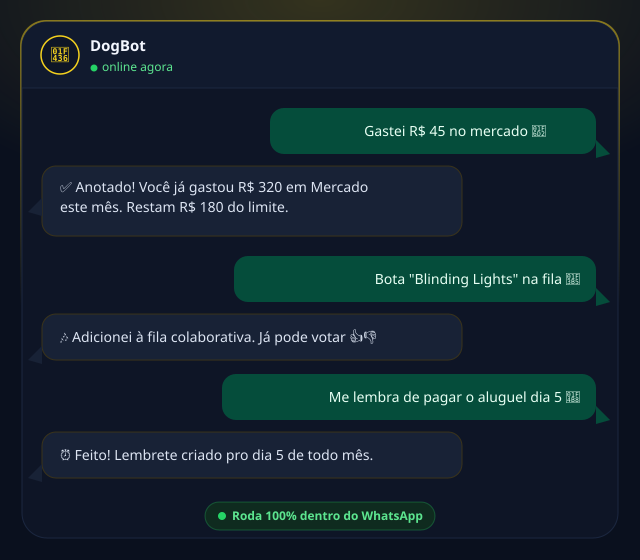

# Olá, me chamo Andrade 👋

Construo produtos de ponta a ponta, do backend à experiência do usuário.

## 🚀 Projetos em destaque

### 🐶 [DogBot](https://dogbot.squareweb.app/)

Assistente pessoal multifuncional direto no WhatsApp, organizado em módulos independentes:

- 💰 **Financeiro** — contas, cartões, orçamentos e agendamentos recorrentes, com dados cifrados por usuário; entende comandos em linguagem natural via IA (ex: "gastei 50 reais de uber", "paguei 800 de aluguel todo dia 5")
- 🔔 **Rotinas** — uma agenda dentro do WhatsApp: lembretes recorrentes configuráveis, individuais ou distribuídos entre membros de um grupo
- 🎬 **DogLog** — diário pessoal de filmes, e livros, com listas colaborativas e cards visuais de resumo
- 🎵 **Spotify** — sessões de Jam colaborativas em grupo, votação de faixas, estatísticas de audição e controle de reprodução, tudo pelo WhatsApp
- 🏆 **Esportes** — bolão da Copa do Mundo com ranking de palpites e notificações em tempo real, além de integração com o Cartola FC
- 🏋️ **Fitness** — registro diário de treino com ranking e streak por grupo, meta anual e contestação por votação

Toda a operação é gerenciada por um painel administrativo próprio em React.

**Stack:** Node.js · React · PostgreSQL · Prisma · whatsapp-web.js

Projeto fechado (código-fonte privado) — inclui também um app companion com bolha flutuante de atalhos (Flutter).

### [GreenLightFlow](https://www.greenlightflow.com/)

SaaS de agendamento e publicação em redes sociais (Instagram, YouTube, TikTok). Fundador e desenvolvedor principal — arquitetei e construí o produto do zero: autenticação, fluxo OAuth para conectar contas, agendamento e publicação via APIs oficiais.

**Stack:** Node.js · Express · PostgreSQL · TypeScript

### 💬 Herm

Plataforma B2B de chatbot para WhatsApp: parceiros (donos de pequenos negócios) criam
fluxos de atendimento num flow builder visual e o bot conversa com os clientes finais
direto no WhatsApp.

- 🧩 **Flow builder visual** — editor drag-and-drop (React Flow) com undo/redo,
  copiar/colar de blocos e templates de cadastro prontos
- 🛍️ **Catálogo com árvore de categorias** — produtos e serviços com variações
  (tamanho/tipo), carrinho, checkout e acompanhamento de pedidos
- 🎠 **Carrossel nativo do WhatsApp** — navegação de catálogo com cartões deslizáveis;
  precisei investigar e corrigir um bug de protocolo numa lib open-source de WhatsApp
  pra viabilizar isso nos 3 clientes (Desktop/Android/iPhone)
- 🔔 **Notificações configuráveis** — alertas de pedido novo, contato novo, estoque
  baixo e resumo diário, cada um pode ser ligado/desligado por número
- 🏢 **Multi-tenant de verdade** — isolamento por parceiro, número de WhatsApp
  compartilhado ou dedicado por conta

**Stack:** Node.js · TypeScript · Express · React · Prisma · PostgreSQL · Baileys

Projeto em desenvolvimento — sem deploy público ainda.

## 🛠️ Tecnologias

