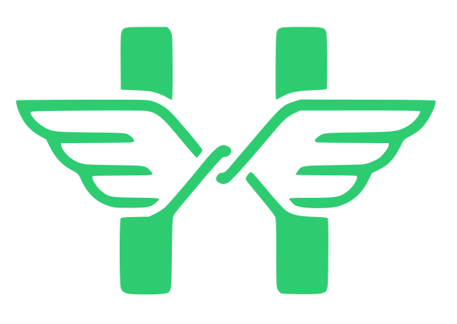

# Andrade

Construo produtos de ponta a ponta, do backend à experiência do usuário.

**Portfólio:** [joaoandrad.github.io](https://joaoandrad.github.io/)

## Projetos

###  Herm

Plataforma B2B de chatbot para WhatsApp: cada parceiro monta seus próprios fluxos de
atendimento num flow builder visual, e o bot conversa direto com os clientes finais
pelo WhatsApp — sem precisar escrever uma linha de código.

- Flow builder visual (React Flow) robusto e com vários templates personalizáveis
- Catálogo com categorias, variações, carrinho e checkout
- Carrossel nativo do WhatsApp para navegação de catálogo
- Isolamento real entre contas, número de WhatsApp dedicado por parceiro

Em desenvolvimento — sem deploy público ainda.

###  [DogBot](https://dogbot.squareweb.app/)

Assistente pessoal multifuncional direto no WhatsApp, organizado em módulos independentes:

- Financeiro — contas, cartões e orçamentos, com comandos em linguagem natural via IA
- Rotinas — lembretes recorrentes individuais ou em grupo
- DogLog — diário pessoal de filmes e livros com listas colaborativas
- Spotify — sessões de Jam colaborativas, votação de faixas e estatísticas
- Esportes — bolão da Copa do Mundo e integração com o Cartola FC
- Fitness — registro de treino com ranking e streak por grupo

Painel administrativo próprio em React.

Código-fonte privado — inclui um app companion com bolha flutuante (para Windows e Android).

### [GreenLightFlow](https://www.greenlightflow.com/)

SaaS de agendamento e publicação em redes sociais para agências e criadores que
gerenciam várias contas ao mesmo tempo. Fundador e desenvolvedor principal —
arquitetei e construí o produto do zero.

- Publicação em Instagram, YouTube, TikTok e LinkedIn, múltiplas contas por provedor
- Fluxo editorial (rascunho → revisado → publicado) antes de qualquer agendamento
- Sistema de armazenamento de mídia próprio usando S3 e Blobs
- Corte e edições básicas de imagem direto no navegador, sem custo de processamento
  no servidor

## Tecnologias

